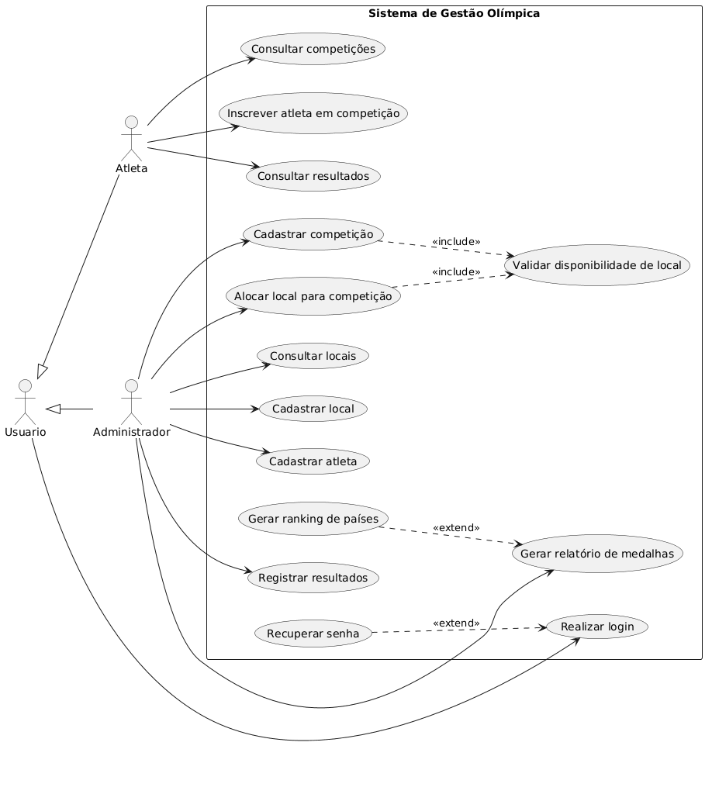
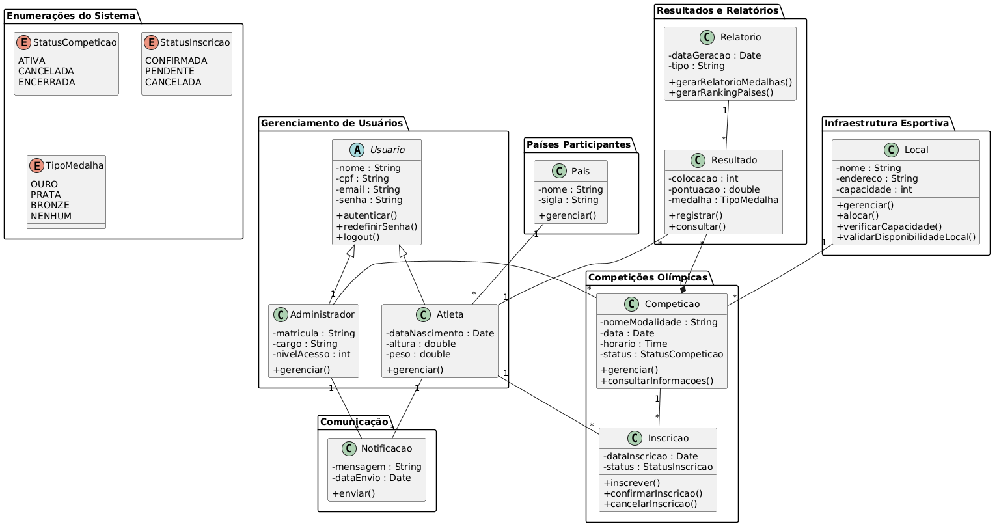
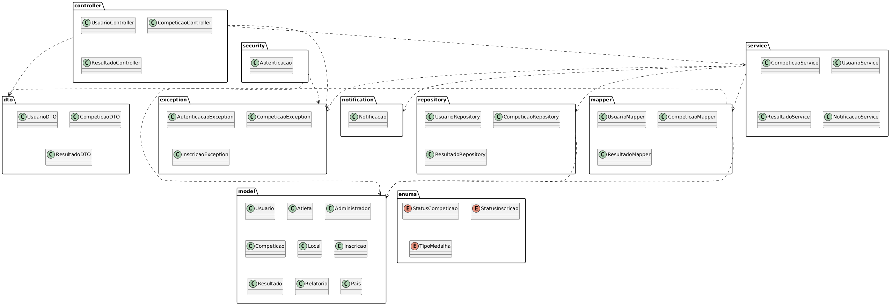
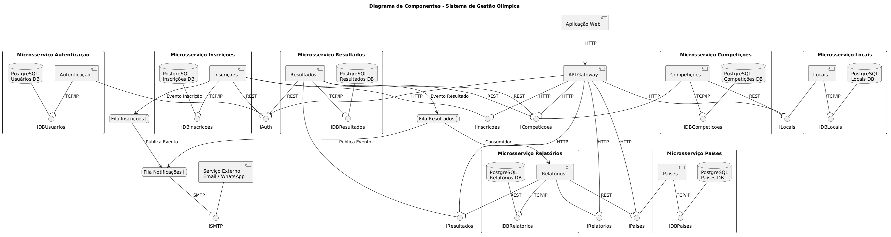
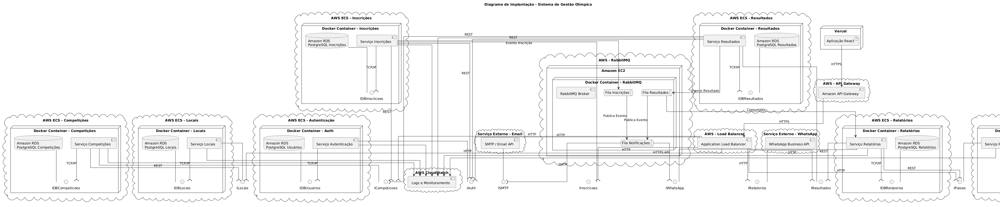
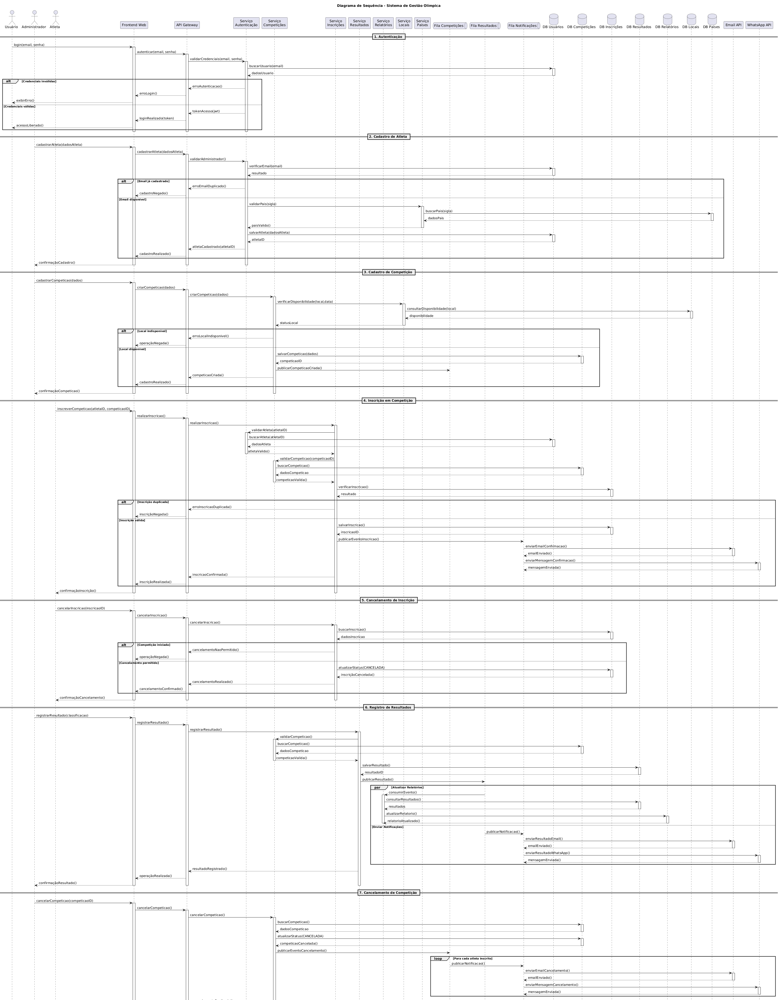

# SGO - Sistema de Gerenciamento de Olimpíadas

<p align="center">
  
  
  
  
</p>

---

## 📋 Índice

- [Sobre o Projeto](#-sobre-o-projeto)
- [Diagramas UML](#-diagramas-uml)
  - [Diagrama de Casos de Uso](#diagrama-de-casos-de-uso)
  - [Diagrama de Classes](#diagrama-de-classes)
  - [Diagrama de Pacotes](#diagrama-de-pacotes)
  - [Diagrama de Componentes](#diagrama-de-componentes)
  - [Diagrama de Implantação](#diagrama-de-implantação)
  - [Diagrama de Sequência](#diagrama-de-sequência)
- [Histórias de Usuário](#-histórias-de-usuário)
- [Estrutura do Repositório](#-estrutura-do-repositório)
- [Autor](#-autor)

---

## 📌 Sobre o Projeto

O **SGO - Sistema de Gerenciamento de Olimpíadas** é um projeto acadêmico desenvolvido no âmbito da disciplina de **Projeto de Software**, cursada no **4º período do curso de Engenharia de Software**. O objetivo central foi aplicar na prática os conhecimentos de modelagem de sistemas orientados a objetos, utilizando a notação **UML (Unified Modeling Language)** para representar a arquitetura e o comportamento de um sistema real.

O SGO tem como propósito gerenciar todos os aspectos de um evento olímpico, desde o cadastro de atletas e competições, passando pela alocação de locais esportivos, até o registro de resultados e a geração de relatórios e rankings. O sistema é concebido sob uma arquitetura de **microsserviços**, com comunicação assíncrona via filas de mensagens e implantação em nuvem.

### Principais funcionalidades modeladas

- Autenticação e controle de acesso por perfil (Usuário, Atleta, Administrador)
- Gestão de competições olímpicas e seus respectivos locais
- Inscrição de atletas em competições com confirmação automatizada
- Registro e consulta de resultados
- Geração de relatórios de medalhas e rankings por país
- Notificações via e-mail e WhatsApp

### Diagramas produzidos

| Diagrama     | Objetivo                                                        |
| ------------ | --------------------------------------------------------------- |
| Casos de Uso | Levantar e documentar os requisitos funcionais do sistema       |
| Classes      | Modelar as entidades do domínio e seus relacionamentos          |
| Pacotes      | Organizar a estrutura lógica e modular do sistema               |
| Componentes  | Representar os módulos de software e suas dependências          |
| Implantação  | Descrever a infraestrutura física e em nuvem da aplicação       |
| Sequência    | Ilustrar o fluxo de interação entre os participantes do sistema |

---

## 📐 Diagramas UML

### Diagrama de Casos de Uso

O **Diagrama de Casos de Uso** é um dos diagramas comportamentais da UML. Seu objetivo é capturar os **requisitos funcionais** do sistema, representando as interações entre os atores externos (usuários ou sistemas) e as funcionalidades oferecidas. Ele responde à pergunta: _"o que o sistema deve fazer?"_, sem se preocupar com como isso será implementado.

No SGO, foram identificados três atores principais:

- **Usuário**: ator genérico e base para os demais, responsável pelo login.
- **Atleta**: herda de Usuário; pode consultar competições, se inscrever e visualizar resultados.
- **Administrador**: herda de Usuário; possui acesso total à gestão do sistema.

<p align="center">
  
</p>

---

### Diagrama de Classes

O **Diagrama de Classes** é o diagrama estrutural mais utilizado na UML. Ele representa as **classes** do sistema, seus atributos, métodos e os relacionamentos entre elas (associações, heranças, dependências, etc.). É a espinha dorsal de qualquer modelagem orientada a objetos, servindo de base para a implementação do código.

No SGO, as classes foram organizadas em cinco pacotes de domínio:

- **Gerenciamento de Usuários**: `Usuario` (abstrata), `Atleta` e `Administrador`.
- **Competições Olímpicas**: `Competicao` e `Inscricao`.
- **Infraestrutura Esportiva**: `Local`.
- **Resultados e Relatórios**: `Resultado` e `Relatorio`.
- **Comunicação**: `Notificacao`.

<p align="center">
  
</p>

---

### Diagrama de Pacotes

O **Diagrama de Pacotes** é um diagrama estrutural que organiza os elementos do sistema em **grupos lógicos** chamados pacotes. Ele evidencia as dependências entre os módulos, facilitando a compreensão da arquitetura em camadas e promovendo um projeto de software coeso e de baixo acoplamento.

No SGO, a estrutura segue o padrão arquitetural em camadas:

- **`controller`**: recebe as requisições HTTP e delega para a camada de serviço.
- **`service`**: contém a lógica de negócio da aplicação.
- **`repository`**: responsável pelo acesso e persistência dos dados.
- **`model`**: entidades do domínio.
- **`dto` / `mapper`**: transferência e transformação de dados entre camadas.
- **`exception`**: tratamento centralizado de erros.
- **`security`**: lógica de autenticação e autorização.
- **`notification`**: envio de notificações.
- **`enums`**: enumerações de domínio (`StatusCompeticao`, `TipoMedalha`, etc.).

<p align="center">
  
</p>

---

### Diagrama de Componentes

O **Diagrama de Componentes** é um diagrama estrutural que descreve como o software é **dividido em componentes** e as dependências entre eles. Ele evidencia as interfaces fornecidas e requeridas por cada componente, sendo fundamental para o planejamento de sistemas baseados em microsserviços.

No SGO, a arquitetura de componentes contempla:

- **Aplicação Web**: frontend que se comunica com um API Gateway via HTTP.
- **Microsserviços independentes**: Autenticação, Competições, Inscrições, Resultados, Relatórios, Locais, Países e Notificações.
- **Filas de mensagens**: para comunicação assíncrona entre serviços (Inscrições, Resultados e Notificações).
- **Bancos de dados isolados**: cada microsserviço possui seu próprio banco PostgreSQL.
- **Serviços externos**: integração com APIs de e-mail e WhatsApp.

<p align="center">
  
</p>

---

### Diagrama de Implantação

O **Diagrama de Implantação** é um diagrama estrutural que representa a **infraestrutura física e lógica** onde o sistema será executado. Ele descreve os nós de hardware e software (servidores, containers, instâncias em nuvem), os artefatos implantados em cada nó e as conexões entre eles. É essencial para planejar ambientes de produção e entender a distribuição do sistema.

No SGO, a infraestrutura projetada utiliza serviços da **AWS** combinados com a plataforma **Vercel**:

- **Vercel**: hospedagem da aplicação React (frontend).
- **Amazon API Gateway**: ponto de entrada único para as requisições da API.
- **Application Load Balancer (ALB)**: balanceamento de carga entre os microsserviços.
- **AWS ECS (Elastic Container Service)**: orquestração dos containers Docker de cada microsserviço.
- **Amazon RDS (PostgreSQL)**: banco de dados relacional gerenciado para cada serviço.
- **Amazon EC2 + Docker (RabbitMQ)**: broker de mensagens para as filas assíncronas.

<p align="center">
  
</p>

---

### Diagrama de Sequência

O **Diagrama de Sequência** é um diagrama comportamental que mostra como os objetos e participantes interagem ao longo do **tempo**, detalhando a troca de mensagens em um determinado cenário. Ele é amplamente utilizado para documentar fluxos de uso específicos, tornando visível a colaboração entre camadas e serviços.

No SGO, o diagrama de sequência cobre os principais fluxos do sistema:

1. **Autenticação**: login com validação de credenciais e emissão de token JWT.
2. **Cadastro de Atleta**: fluxo de criação de atleta pelo Administrador.
3. **Cadastro de Competição e Alocação de Local**: criação de competição com validação de disponibilidade do local.
4. **Inscrição de Atleta**: inscrição assíncrona com notificação de confirmação.
5. **Registro de Resultado**: registro de resultado pelo Administrador e notificação ao Atleta.
6. **Geração de Relatório**: geração de relatório de medalhas e ranking de países.

<p align="center">
  
</p>

---

## 📖 Histórias de Usuário

As histórias de usuário foram elaboradas a partir dos casos de uso identificados no Diagrama de Casos de Uso do SGO, seguindo o formato padrão: _"Como **[ator]**, quero **[funcionalidade]**, para **[objetivo/valor]**"_.

---

### US01: Realizar Login

> **Como** usuário do sistema (Atleta ou Administrador), **quero** realizar login com meu e-mail e senha, **para** acessar as funcionalidades disponíveis de acordo com o meu perfil.

**Critérios de aceitação:**

- O sistema deve validar o e-mail e a senha informados.
- Em caso de credenciais inválidas, o sistema deve exibir uma mensagem de erro clara.
- Em caso de sucesso, o sistema deve gerar um token de acesso (JWT) e redirecionar o usuário para a área correspondente ao seu perfil.

---

### US02: Recuperar Senha

> **Como** usuário do sistema, **quero** recuperar minha senha em caso de esquecimento, **para** retomar o acesso à minha conta sem a necessidade de intervenção de um administrador.

**Critérios de aceitação:**

- O sistema deve oferecer um fluxo de recuperação acessível a partir da tela de login.
- O usuário deve receber um link de redefinição de senha no e-mail cadastrado.
- O link deve expirar após um período determinado por questões de segurança.

---

### US03: Cadastrar Competição

> **Como** administrador, **quero** cadastrar novas competições olímpicas no sistema, **para** que elas fiquem disponíveis para inscrição e acompanhamento pelos atletas.

**Critérios de aceitação:**

- O administrador deve informar: nome da modalidade, data, horário e local.
- O sistema deve validar a disponibilidade do local antes de confirmar o cadastro.
- A competição deve ser criada com o status inicial `AGENDADA`.

---

### US04: Consultar Competições

> **Como** atleta, **quero** consultar as competições disponíveis no sistema, **para** verificar as modalidades, datas, horários e locais antes de realizar minha inscrição.

**Critérios de aceitação:**

- O sistema deve listar todas as competições com status ativo.
- O atleta deve poder filtrar competições por modalidade, data ou status.
- As informações exibidas devem incluir: nome da modalidade, data, horário e local.

---

### US05: Cadastrar Atleta

> **Como** administrador, **quero** cadastrar atletas no sistema, **para** que eles possam ser inscritos em competições e ter seus resultados registrados.

**Critérios de aceitação:**

- O administrador deve informar os dados do atleta: nome, CPF, e-mail, data de nascimento, altura, peso e país representado.
- O sistema deve validar a unicidade do CPF e do e-mail.
- Após o cadastro, o atleta deve receber um e-mail com suas credenciais de acesso.

---

### US06: Inscrever Atleta em Competição

> **Como** atleta, **quero** me inscrever em uma competição disponível, **para** participar oficialmente da modalidade de meu interesse nos jogos olímpicos.

**Critérios de aceitação:**

- O atleta deve poder selecionar uma competição e confirmar a inscrição.
- O sistema deve verificar se o atleta já está inscrito na mesma competição.
- Após a inscrição, uma mensagem de confirmação deve ser enviada ao atleta (e-mail ou WhatsApp).
- A inscrição deve ser criada com o status `PENDENTE` até a confirmação do administrador.

---

### US07: Cadastrar Local

> **Como** administrador, **quero** cadastrar os locais esportivos disponíveis no sistema, **para** que eles possam ser alocados às competições durante o planejamento do evento.

**Critérios de aceitação:**

- O administrador deve informar: nome do local, endereço e capacidade máxima.
- O sistema deve impedir o cadastro de locais com nome duplicado.
- O local deve ficar disponível imediatamente para alocação após o cadastro.

---

### US08: Alocar Local para Competição

> **Como** administrador, **quero** alocar um local esportivo a uma competição, **para** garantir que cada evento tenha um espaço físico reservado e organizado.

**Critérios de aceitação:**

- O administrador deve selecionar a competição e o local desejado.
- O sistema deve validar automaticamente a disponibilidade do local na data e horário informados.
- Em caso de conflito de horário, o sistema deve notificar o administrador e impedir a alocação.

---

### US09: Validar Disponibilidade de Local

> **Como** sistema, **quero** validar automaticamente a disponibilidade de um local sempre que houver uma tentativa de alocação ou cadastro de competição, **para** evitar conflitos de agendamento entre diferentes eventos.

**Critérios de aceitação:**

- A validação deve ser disparada automaticamente como parte dos fluxos de cadastro de competição e alocação de local.
- O sistema deve verificar se o local já possui outro evento agendado na mesma data e horário.
- O resultado da validação deve influenciar diretamente a conclusão ou rejeição da operação em curso.

---

### US10: Registrar Resultado

> **Como** administrador, **quero** registrar o resultado de um atleta em uma competição, **para** que a colocação, pontuação e eventual medalha sejam documentadas oficialmente no sistema.

**Critérios de aceitação:**

- O administrador deve informar: atleta, competição, colocação, pontuação e tipo de medalha (Ouro, Prata, Bronze ou nenhuma).
- O sistema deve notificar o atleta sobre o resultado registrado.
- O resultado deve ficar disponível para consulta imediatamente após o registro.

---

### US11: Consultar Resultados

> **Como** atleta, **quero** consultar os resultados das competições das quais participei, **para** acompanhar meu desempenho e minhas conquistas ao longo dos jogos.

**Critérios de aceitação:**

- O atleta deve visualizar somente os resultados vinculados ao seu perfil.
- As informações exibidas devem incluir: competição, colocação, pontuação e medalha conquistada (se houver).
- Os resultados devem ser exibidos em ordem cronológica.

---

### US12: Gerar Relatório de Medalhas

> **Como** administrador, **quero** gerar um relatório completo de medalhas conquistadas nos jogos, **para** ter uma visão consolidada do desempenho de atletas e países ao longo do evento.

**Critérios de aceitação:**

- O relatório deve listar todos os atletas que conquistaram medalhas, agrupados por tipo (Ouro, Prata, Bronze).
- O relatório deve ser gerado com a data de criação registrada.
- O administrador deve poder exportar ou visualizar o relatório diretamente pelo sistema.

---

### US13: Gerar Ranking de Países

> **Como** administrador, **quero** gerar um ranking de países com base nas medalhas conquistadas por seus atletas, **para** acompanhar o quadro de medalhas geral dos jogos olímpicos.

**Critérios de aceitação:**

- O ranking deve ser calculado priorizando o número de medalhas de Ouro, seguido de Prata e depois Bronze.
- O ranking deve ser acessado como uma extensão do relatório de medalhas.
- As informações devem incluir: posição, país, total de ouros, pratas e bronzes.

---

### US14: Confirmação de Inscrição

> **Como** administrador, **quero** confirmar ou rejeitar as inscrições pendentes de atletas em competições, **para** garantir que apenas inscrições válidas e dentro dos critérios sejam efetivadas.

**Critérios de aceitação:**

- O administrador deve visualizar a lista de inscrições com status `PENDENTE`.
- Ao confirmar, o status da inscrição deve ser atualizado para `CONFIRMADA` e o atleta notificado.
- Ao rejeitar, o status deve ser atualizado para `CANCELADA` e o atleta notificado com a justificativa.

---

## 📁 Estrutura do Repositório

```
olympic-system-modeling/
│
├── README.md
│
├── images/
│   ├── use-case-diagram.png
│   ├── class-diagram.png
│   ├── package-diagram.png
│   ├── component-diagram.png
│   ├── deployment-diagram.png
│   └── sequence-diagram.png
│
└── codes/
    ├── use-case-diagram.puml
    ├── class-diagram.puml
    ├── package-diagram.puml
    ├── component-diagram.puml
    ├── deployment-diagram.puml
    └── sequence-diagram.puml
```

---

## 👨🏻‍💻 Autor

---

| [<br><sub>Artur Bomtempo</sub>](https://arturbomtempo.dev/) |
| :--------------------------------------------------------------------------------------------------------------------------------------------------: |

Desenvolvido por Artur Bomtempo 👋🏻. Entre em contato:

[](mailto:arturbcolen@gmail.com)
[](https://www.linkedin.com/in/artur-bomtempo/)
[](https://www.instagram.com/arturbomtempo.dev/)
